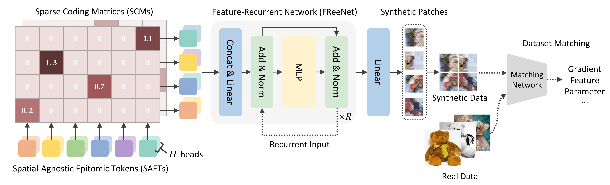

# SPEED

The official PyTorch implementation of our **NeurIPS 2023 poster** paper:

[Sparse Parameterization for Epitomic Dataset Distillation](https://.pdf) 

*Xing Wei, Anjia Cao, Funing Yang, and Zhiheng Ma.*

GitHub maintainer: [Anjia Cao](https://github.com/CAOANJIA)

## Highlight

<div align=center></div>

### :bookmark:Brief Introduction

The success of deep learning relies heavily on large and diverse datasets, but the storage, preprocessing, and training of such data present significant challenges. To address these challenges, dataset distillation techniques have been proposed to obtain smaller synthetic datasets that capture the essential information of the originals. In this paper, we introduce a **Sparse Parameterization for Epitomic datasEt Distillation (SPEED)** framework, which leverages the concept of dictionary learning and sparse coding to distill epitomes that represent pivotal information of the dataset. SPEED prioritizes proper parameterization of the synthetic dataset and introduces techniques to **capture spatial redundancy within and between synthetic images**. We propose **Spatial-Agnostic Epitomic Tokens (SAETs)** and **Sparse Coding Matrices (SCMs)** to efficiently represent and select significant features. Additionally, we build a **Feature-Recurrent Network (FReeNet)** to generate hierarchical features with high compression and storage efficiency. Experimental results demonstrate the superiority of SPEED in handling high-resolution datasets, achieving state-of-the-art performance on multiple benchmarks and downstream applications. Our framework is compatible with a variety of dataset matching approaches, enhancing their performance. This work highlights the importance of proper parameterization in epitomic dataset distillation and opens avenues for efficient representation learning.

### :bookmark:Distilled Images


### :bookmark:Strong Performance

* Standard Benchmarks (CIFAR10, CIFAR100, and TinyImageNet):

|        IPC         |         1          |         10         |         50         |
|:------------------:|:------------------:|:------------------:|:------------------:|
|      CIFAR10       |   63.2 $\pm$ 0.1   | **73.5 $\pm$ 0.2** | **77.7 $\pm$ 0.4** |
|      CIFAR100      | **40.0 $\pm$ 0.4** | **45.9 $\pm$ 0.3** | **49.1 $\pm$ 0.2** |
|    TinyImageNet    | **26.9 $\pm$ 0.3** | **28.8 $\pm$ 0.2** | **30.1 $\pm$ 0.3** |

* High Resolution Datasets (ImageNet subsets):

|        IPC         |         1          |         10         |
|:------------------:|:------------------:|:------------------:|
|     ImageNette     | **66.9 $\pm$ 0.7** | **72.9 $\pm$ 1.5** |
|     ImageWoof      | **38.0 $\pm$ 0.9** | **44.1 $\pm$ 1.4** |
|     ImageFruit     | **43.4 $\pm$ 0.6** | **50.0 $\pm$ 0.8** |
|     ImageMeow      | **43.6 $\pm$ 0.7** | **52.0 $\pm$ 1.3** |
|    ImageSquawk     | **60.9 $\pm$ 1.0** | **71.8 $\pm$ 1.3** |
|    ImageYellow     | **62.6 $\pm$ 1.3** | **70.5 $\pm$ 1.5** |

## Install the environment

* Clone the repo:
```
git clone https://github.com/MIV-XJTU/SPEED.git
cd SPEED
```

* Create a new environment:
```
conda create -n speed python==3.8
conda activate speed
pip install -r requirements.txt
```

## Distilling

* For CIFAR10 and CIFAR100:
```
python buffer.py --dataset {CIFAR10/CIFAR100} --model ConvNet --train_epochs 50 --num_experts 100 --zca
python distill.py --dataset {CIFAR10/CIFAR100} --model ConvNet --zca
```

* For TinyImageNet:
```
python buffer.py --dataset Tiny --model ConvNetD4 --train_epochs 50 --num_experts 100
python distill.py --dataset Tiny --model ConvNetD4
```

* For ImageNet subsets (e.g. ImageNette):
```
python buffer.py --dataset ImageNet --subset imagenette --model ConvNetD5 --train_epochs 50 --num_experts 100
python distill.py --dataset ImageNet --subset imagenette --model ConvNetD5
```

More hyperparameter settings are concluded at the end of networks.py. After distillation, you will obtain four components: *saet, scm, freenet, and syn_lr.*

## Evaluation

* For CIFAR10 and CIFAR100:
```
python eval.py --dataset {CIFAR10/CIFAR100} --model ConvNet --zca
```

* For TinyImageNet:
```
python eval.py --dataset Tiny --model ConvNetD4
```

* For ImageNet subsets (e.g. ImageNette):
```
python eval.py --dataset ImageNet --subset imagenette --model ConvNetD5
```

Before evaluation, please specify the distilled components' paths: *--saet_path, --scm_path, --freenet_path, --syn_lr_path.* 

## Acknowledgement

Our work is implemented base on the following projects. We really appreciate their excellent open-source works!

- [DatasetCondensation](https://github.com/VICO-UoE/DatasetCondensation) [[related paper](https://openreview.net/pdf?id=mSAKhLYLSsl)][[related paper](https://browse.arxiv.org/pdf/2110.04181.pdf)]
- [mtt-distillation](https://github.com/GeorgeCazenavette/mtt-distillation) [[related paper](https://arxiv.org/abs/2203.11932)]
- [DatasetFactorization](https://github.com/Huage001/DatasetFactorization) [[related paper](https://arxiv.org/abs/2210.16774)]

## Citation

If any parts of our paper and code help your research, please consider citing us and giving a star to our repository.

```
@inproceedings{wei2023sparse,
    title={Sparse Parameterization for Epitomic Dataset Distillation},
    author={Wei, Xing and Cao, Anjia and Yang, Funing and Ma, Zhiheng},
    booktitle={Thirty-seventh Conference on Neural Information Processing Systems},
    year={2023}
}
```